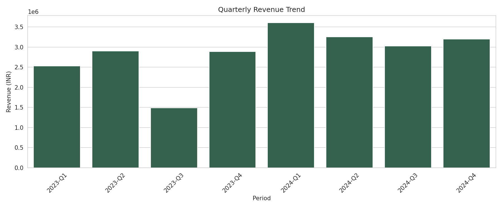
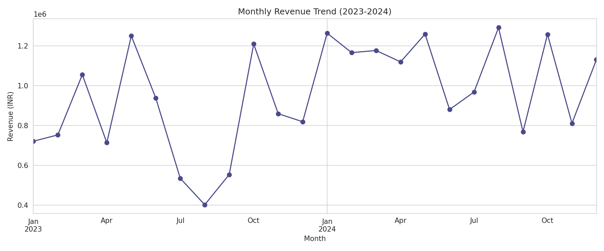
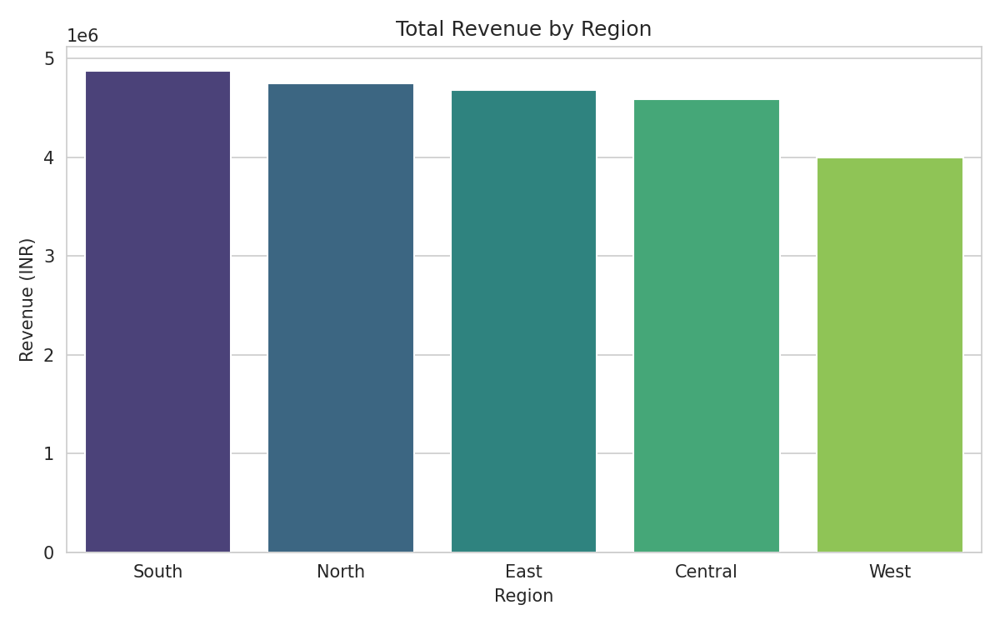
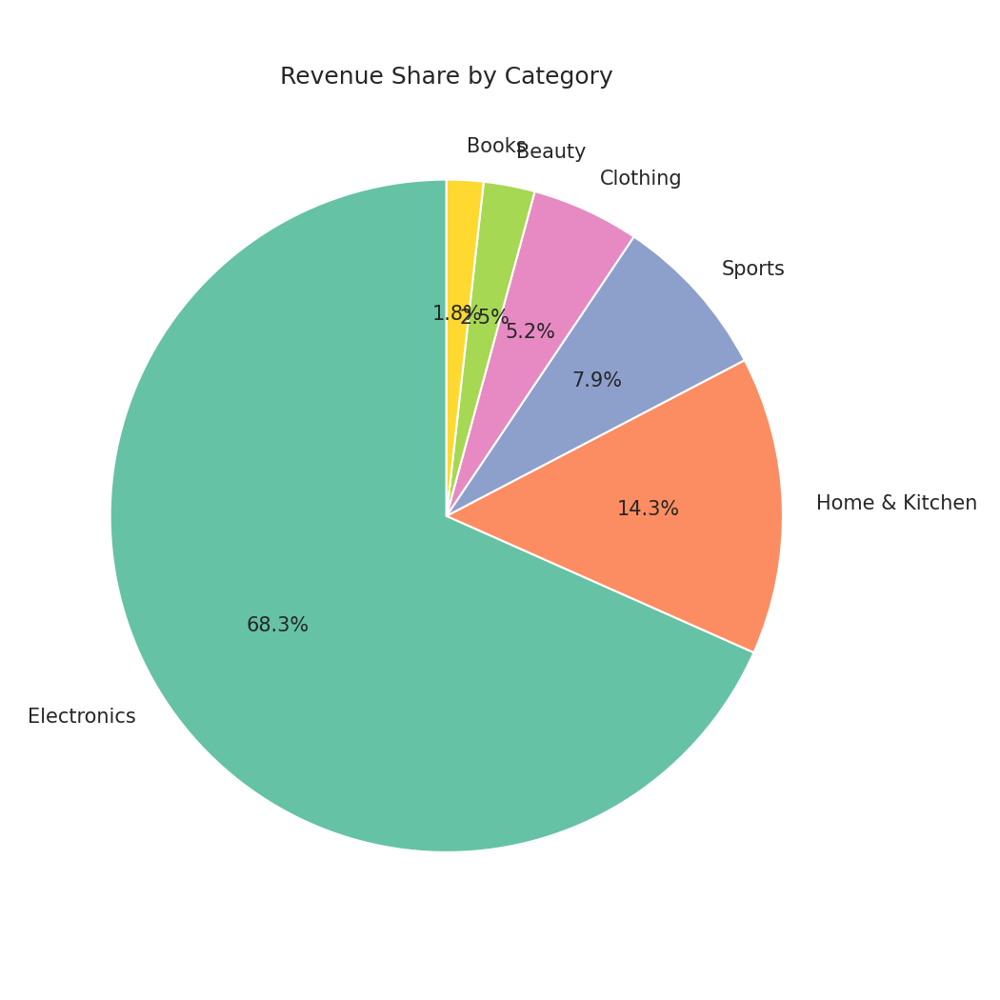
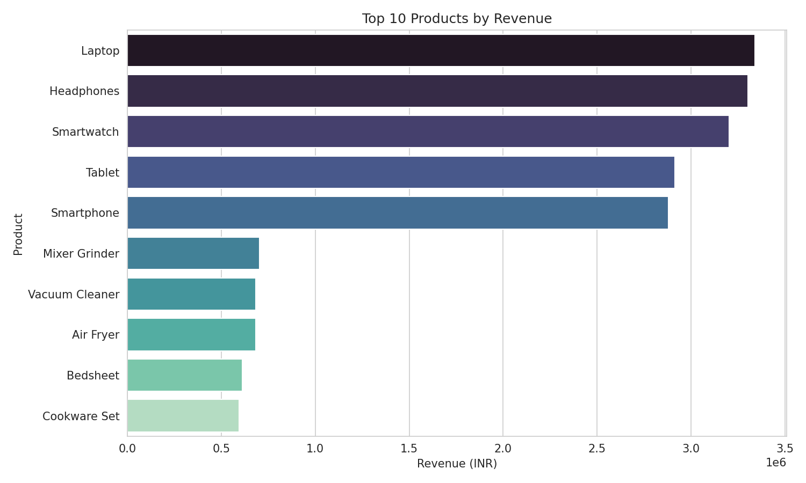

# 📊 Retail Sales Performance Analysis & Dashboard

Analyzed 2 years (2023–2024) of retail sales data (~1,900 orders) to uncover sales trends, regional performance, and customer behavior — using **SQL, Python, Power BI, and Excel**.


---

## 🎯 Objective

To help business stakeholders understand sales performance across regions, product categories, and time periods — enabling data-driven decisions for inventory planning and marketing strategy.

---

## 🛠️ Tools & Technologies

| Tool | Purpose |
|---|---|
| **SQL** | Data extraction, cleaning, and aggregation queries |
| **Python (Pandas, Matplotlib, Seaborn)** | Data wrangling, EDA, and visualization |
| **Power BI** | Interactive dashboard for stakeholders |
| **Excel** | Pivot tables and quick summary reports |

---

## 📁 Repository Structure

```
Retail-Sales-Analysis-Dashboard/
│
├── data/
│   └── sales_data.csv                 # Raw dataset (1,895 orders)
│
├── sql/
│   └── data_extraction_queries.sql    # 12 analysis queries
│
├── python/
│   └── data_cleaning_eda.ipynb        # Full EDA notebook
│
├── excel/
│   └── pivot_analysis.xlsx            # Pivot tables + charts
│
├── powerbi/
│   └── sales_dashboard.pbix           # Interactive dashboard
│
├── images/
│   ├── monthly_trend.png
│   ├── region_revenue.png
│   ├── category_share.png
│   ├── quarterly_trend.png
│   └── top_products.png
│
└── README.md
```

---

## 📊 Dataset Overview

| Column | Description |
|---|---|
| `OrderID` | Unique order identifier |
| `OrderDate` | Date of the order |
| `Region` | North / South / East / West / Central |
| `Category` | Product category |
| `Product` | Product name |
| `Quantity` | Units purchased |
| `Price` | Unit price (₹) |
| `Discount_Percent` | Discount applied |
| `PaymentMode` | Mode of payment |
| `CustomerSegment` | New / Returning / Loyal |
| `Rating` | Customer rating (1–5) |
| `TotalAmount` | Final order value after discount |

---

## 📈 Key Insights

### 1. Quarterly Revenue Trend
A clear **revenue dip in Q3 2023** (₹14.9L vs ₹28.9L in Q2) was identified, correlating with an inventory shortage period.



### 2. Monthly Revenue Trend
Overall revenue shows a strong upward trajectory into 2024 after recovery from the Q3 2023 dip.



### 3. Revenue by Region
Regional performance varies significantly, highlighting where marketing budget could be reallocated.



### 4. Category-wise Revenue Share
Electronics leads as the top revenue-generating category.



### 5. Top 10 Products by Revenue



---

## 💡 Business Recommendations

1. **Strengthen inventory planning** ahead of Q3 to prevent stockouts and revenue loss
2. **Reallocate marketing budget** toward top-performing regions
3. **Launch loyalty programs** to convert "New" customers into "Returning/Loyal" — loyal customers show higher average order value
4. **Bundle low-rated products** with top sellers to improve visibility and ratings

---

## 🚀 How to Use This Project

1. Clone the repository
   ```bash
   git clone https://github.com/YOUR-USERNAME/Retail-Sales-Analysis-Dashboard.git
   ```
2. Import `data/sales_data.csv` into your SQL database and run queries from `sql/data_extraction_queries.sql`
3. Open `python/data_cleaning_eda.ipynb` in Jupyter Notebook to reproduce the analysis
4. Open `excel/pivot_analysis.xlsx` to explore pivot tables
5. Open `powerbi/sales_dashboard.pbix` in Power BI Desktop for the interactive dashboard

---

## 📬 Connect With Me

If you found this project useful, feel free to connect or reach out with feedback!

**LinkedIn:** [Add your LinkedIn URL]
**Email:** [Add your email]

---

⭐ If you like this project, consider giving it a star!
